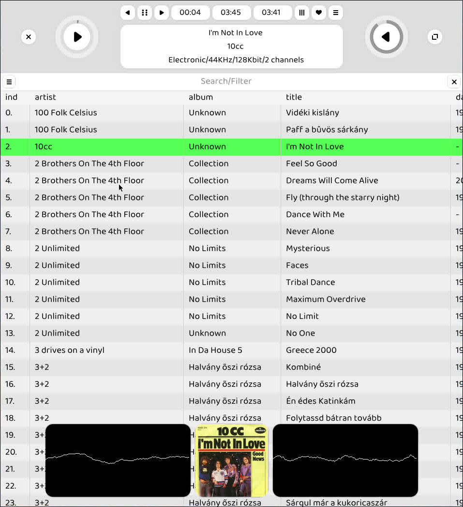

# Zen Music

Zen Music is a music player, visualizer and organizer inspired by the 2000's era iTunes and the tracker music players of the early 90's.

Click on image for video introduction :
[](https://www.youtube.com/watch?v=bF0g5mw_2P0)

## Features ##

- retro-minimalistic UI
- beautiful and smooth UX experience
- always-on frequency and scope analyzer visualizers
- library auto-organization ( if enabled )
- activity window and human-readable database for transparent operation

Read the user guide for further information : [Open User Guide](doc/USER.md)

## Installation ##

### FreeBSD ###

```
git clone https://github.com/milgra/zenmusic.git
cd zenmusic
sudo make deps
make build
sudo make install
```

### Arch based Linuxes ###

```
sudo pacman -Syyu
sudo pacman -S make clang ffmpeg sdl2 glew
git clone https://github.com/milgra/zenmusic.git
cd zenmusic
make -f makefileARCH build
sudo make -f makefileARCH install
```

### Debian based Linuxes ###

```
sudo apt update && upgrader
sudo apt install -S make ffmpeg sdl2 glew
git clone https://github.com/milgra/zenmusic.git
cd zenmusic
make -f makefileARCH rel
sudo make -f makefileARCH install
```

## User Guide ##

[Open User Guide](doc/USER.md)

## Feedback ##

Please report issues and add feature requests here on github.

## Libraries used - Thanks for creating these! ##

- FFMPEG / media parsing
- SDL2 / window/graphics context handling
- stb_truetype / text generation
- Neil Hanning's utf8.h / case-insensitive utf8 comparison

## Programs used - Thanks for creating these! ##

- Inkscape for the icons
- GNU Emacs for programming
- FreeBSD for development platform

## Contribute ##

Contributors are welcome!

## Tech Guide ##

[Tech Guide](doc/TECH.md)

## Roadmap ##

[Roadmap](doc/ROAD.md)

## License ##

Zen Music is released under the GPLv3 (or later) license.